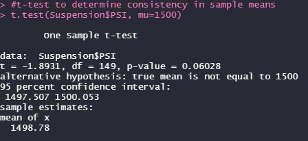

# MechaCar_Statistical_Analysis
 
## A statistical analysis of vehicle manufacturer data with R.

### Project Overview

The MechaCar dataset contains the miles-per-gallon test results for 50 prototype MechaCars manufactured by the fictitious company, AutosRU. In this scenario, the MechaCar prototype was undergoing production trouble and needed a statistical analysis conducted to uncover insights that could lead to improvements. 
The MechaCar prototypes were produced using multiple design specifications to measure vehicle performance. Metrics such as vehicle length, vehicle weight, spoiler angle, drivetrain and ground clearance were aggregated for each vehicle within the dataset. In this project, a linear model to predict the MPG of the prototypes was created utilizing several variables from the dataset with the R programming language and the RStudio GUI (graphical user interface). 

The following objectives were accomplished in this analysis:

* Variables which predict the MPG for vehicle prototypes were discovered.
* Summary statistics on the pounds per square inch of suspension coils were collected.
* Manufacturing lots that were determined to be statistically different from the mean population were analyzed.
* A study to compare the MechaCar performance against vehicles from other manufacturers was designed.

### Resources

#### Datasets

* MechaCar_mpg.csv
* Suspension_Coil.csv

#### Software

* R 4.2.1
* RStudio 2022.07.2 Build 576

### Results

The Tidyverse package in R was used to clean and reshape the datasets as well as provide the linear model function and summary methods needed within R to accomplish the statistical summaries annotated within this analysis.

Below is the statistical summary table for the entire dataset:

#### Linear Regression to Predict MPG

Some of the variables and coefficients provided non-random amounts of variance (generally set at 0) to the MPG values within the dataset, such as the vehicle length (p-value: 2.60e-12) and vehicle ground clearance (p-value: 5.21e-08). The vehicle length and ground clearance variables were statistically significant, as their p-values fell below the 0.5% significance level (alpha) and were found to be statistically likely to provide non-random amounts of variance to the model. These variables had a significant impact on the miles per gallon of the MechaCar prototype. Conversely, the vehicle weight, spoiler angle and all-wheel drive (AWD) had p-values that indicated random amounts of variance in the dataset. The y-intercept was also noted to be statistically significant, indicating there are likely other factors that were not included within the dataset that strongly impact the MPG of the prototypes. 

The slope of the linear model is not zero, meaning the relationship between the variables and MPG is subject to more than just random chance. The p-value for the model is 5.35e-11, which is smaller than the extreme significance level of 0.05%, proposing that there is sufficient statistical reasoning to reject the null hypothesis. 
This linear model has an r-squared value of 0.7149, which means that that the values of this linear model will be correctly predicted 71% of the time. 

#### Summary Statistics on Suspension Coils

The design specifications for the MechaCar suspension coils dictate that the variance of the suspension coils must not exceed 100 pounds per square inch. In this analysis, it was observed that Manufacturing Lot 1 (variance: .1) and 2 (7.4 variance) were both within design specifications; however, Manufacturing Lot 3 reported an abnormally high variance of 170.3 pounds per square inch and thus did not meet the maximum variance requirements. 

The most impactful contributor to variance is Manufacturing Lot 3, with a variance of 170 pounds per square inch, while the other two manufacturing lots have variances below 8. 

The variance of all three manufacturing lots together falls under the maximum variance allowance of 100 pounds per square inch with a variance of 62. 

Below is a summary table listing the metrics for each manufacturing lot:

Below is a box plot that visualizes this data, where the anomalous data from Manufacturing Lot 3 can be observed:

#### T-Test on Suspension Coils 

T-tests were conducted on the suspension coil data to determine whether there was a statistical difference between the mean of the provided sample dataset and a hypothesized dataset using a presumed population mean of 1500 pounds per square inch. 

In the t-test comparing all lots against the population mean of 1,500, it is observed that the sample mean was 1498.78 and the p-value is 0.06028, which is not low enough to reject the null hypothesis. The results from the T-test for the suspension coils across all manufacturing lots shows that they are not statistically different from the population mean. 

A review of the results of the T-test for the suspension coils for Lot 1 shows that the p-value of 1 is a perfect match to the population mean of 1500, therefore there is no statistical significance, and the null hypothesis cannot be rejected. 

A review of the results of the T-test for the suspension coils for Lot 2 shows that the 0.06 p-value is not statistically different from the 1,499 population mean and greater than the 0.05% significance level, thus not low enough to reject the null hypothesis.

A review of the results of the T-test for the suspension coils for Lot 3 shows that the 0.04168 p-value is slightly statistically different from the 1,496 population mean, and the p-value is just low enough (0.0417) for us to reject the null hypothesis. 

#### Study Design: AutoRU versus the Competition

Another statistical analysis studying the city versus highway fuel efficiency with AutoRU and its competitors should be conducted. This study should measure cost, fuel efficiency and safety ratings of AutoRU against its competitors’ metrics. These three categories are chosen because they are a few of the most heavily considered metrics by consumers when purchasing a car. 

The null hypothesis for all three metrics would be that the cost, fuel efficiency and safety ratings are equal amongst AutoRU and its competitors. In the alternative hypothesis for each metric, at least one vehicle manufacturer would have a different rating. The ANOVA (analysis of variance) test would be chosen to apply to this study since it is used to measure the means of continuous numerical variables across multiple groups. The cost analysis would use a one-way ANOVA test. The fuel efficiency analysis would use a two-way ANOVA test to study two conditions, highway and city miles per gallon.  The safety rating analysis would use a one-way ANOVA test. Data needed from an equal number of competitors’ vehicles to compare against AutoRU MechaCar dataset would be needed in all three categories studied to conduct this analysis. 
